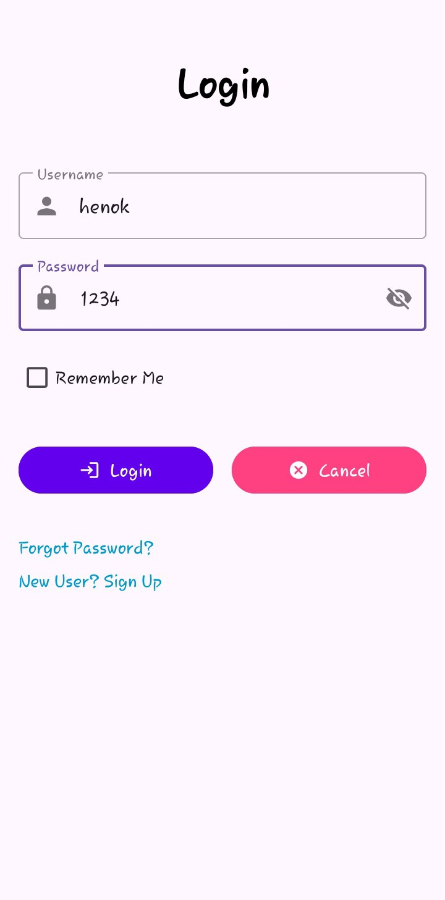
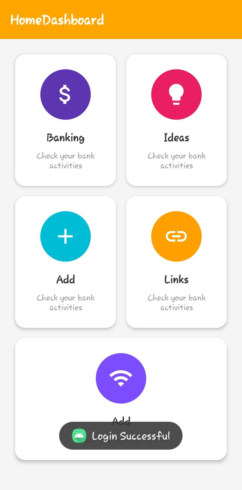
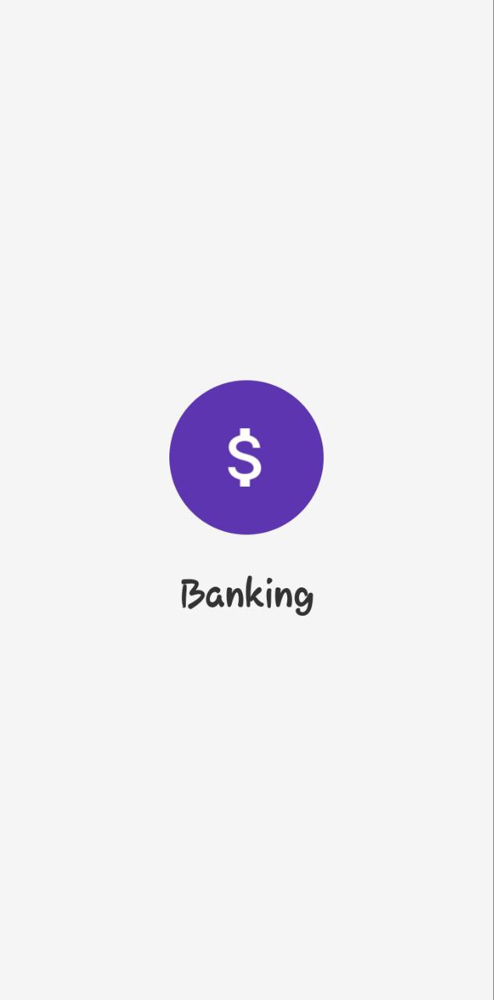

# 📱 Henock Mekonnen Mobile App

A modern Android application built with **Kotlin** and **Material Design** principles. This app features a complete authentication system, interactive dashboard, and multiple activity management screens for banking, ideas, links, and more.

---

## ✨ Features

### 🔐 Authentication

- **Login Screen** with:
  - Username & Password input fields
  - Show/Hide password toggle
  - "Remember Me" checkbox
  - Input validation
  - Secure credential checking

### 🏠 Dashboard

- **Interactive Home Dashboard** with:
  - Beautiful grid-style card layout
  - Material Design cards with ripple effects
  - Smooth navigation to different sections
  - Modern, clean UI using MaterialCardView
  - Responsive touch feedback

### 📂 Activity Management

- **Banking Activity** - Manage your banking information
- **Ideas Activity** - Store and organize your ideas
- **Links Activity** - Keep track of important links
- **Add Activity** - Create and add new activities
- **Detail Screen** - View detailed information

### 🎨 UI/UX

- Material Design 3 components
- Smooth animations and transitions
- Consistent color scheme and typography
- Toast notifications for user feedback
- Back navigation support for all sub-activities

---

## 🔐 Login Credentials (For Testing)

Use the following credentials to access the app:

```
Username: henok
Password: 1234
```

---

## 🧭 App Flow

1. **Launch** → App opens with the Login screen
2. **Authentication** → User enters credentials
3. **Validation** → System validates username and password
4. **Success** → Toast message displays "Login Successful"
5. **Dashboard** → User is redirected to the Home Dashboard
6. **Navigation** → User can click on any card to navigate to:
   - Banking Activity
   - Ideas Activity
   - Links Activity
   - Add Activity
7. **Back Navigation** → All activities support back navigation to Dashboard

---

## 🛠️ Tech Stack

- **Language:** Kotlin
- **UI Framework:** Android XML Layouts
- **Design System:** Material Design 3
- **Architecture:** Activity-based navigation
- **IDE:** Android Studio
- **Min SDK:** API Level 21 (Android 5.0)
- **Target SDK:** Latest stable version

---

## 📸 Screenshots

|          Login Screen           |             Home Dashboard              |              Detail Screen              |
| :-----------------------------: | :-------------------------------------: | :-------------------------------------: |
|  |  |  |

_Screenshots showcase the modern Material Design UI with smooth transitions and intuitive navigation._

---

## 📁 Project Structure

```
app/
├── src/
│   └── main/
│       ├── java/com/example/myapp/
│       │   ├── LoginPage.kt              # Login activity
│       │   ├── DashboardActivity.kt      # Main dashboard
│       │   ├── BankingActivity.kt        # Banking management
│       │   ├── IdeasActivity.kt          # Ideas management
│       │   ├── LinksActivity.kt          # Links management
│       │   ├── AddActivity.kt            # Add new activities
│       │   └── AddActivityPage.kt        # Activity detail page
│       ├── res/
│       │   ├── layout/                   # XML layout files
│       │   ├── values/                   # Styles, colors, strings
│       │   └── drawable/                 # Icons and images
│       └── AndroidManifest.xml           # App configuration
└── build.gradle.kts
```

---

## 🚀 How to Run the Project

### Prerequisites

- Android Studio (Latest version recommended)
- JDK 11 or higher
- Android SDK

### Installation Steps

1. **Clone the repository:**

   ```bash
   git clone https://github.com/your-username/henock-mekonnen-mobile-app.git
   ```

2. **Open in Android Studio:**

   - Launch Android Studio
   - Click "Open an Existing Project"
   - Navigate to the cloned repository folder
   - Select the project folder

3. **Sync Gradle:**

   - Android Studio will automatically sync Gradle files
   - Wait for the build to complete

4. **Run the app:**

   - Connect an Android device via USB (with USB debugging enabled)
   - OR start an Android emulator
   - Click the "Run" button (▶️) in Android Studio

5. **Login:**
   - Use the credentials: `henok` / `1234`
   - Explore the dashboard and activities!

---

## 🔧 Configuration

### Changing Login Credentials

To modify the login credentials, edit the validation logic in `LoginPage.kt`:

```kotlin
// Find this section in LoginPage.kt
if (username == "henok" && password == "1234") {
    // Login successful
}
```

### Customizing Theme

Edit the theme in `res/values/themes.xml` to customize colors and styles.

---

## 🤝 Contributing

Contributions are welcome! If you'd like to improve this project:

1. Fork the repository
2. Create a feature branch (`git checkout -b feature/AmazingFeature`)
3. Commit your changes (`git commit -m 'Add some AmazingFeature'`)
4. Push to the branch (`git push origin feature/AmazingFeature`)
5. Open a Pull Request

---

## 👨‍💻 Author

**Henock Mekonnen**

- GitHub: [@hena7](https://github.com/hena7)
- Email: henockmekonnen105@gmail.com

---

**⭐ If you found this project helpful, please give it a star!**
